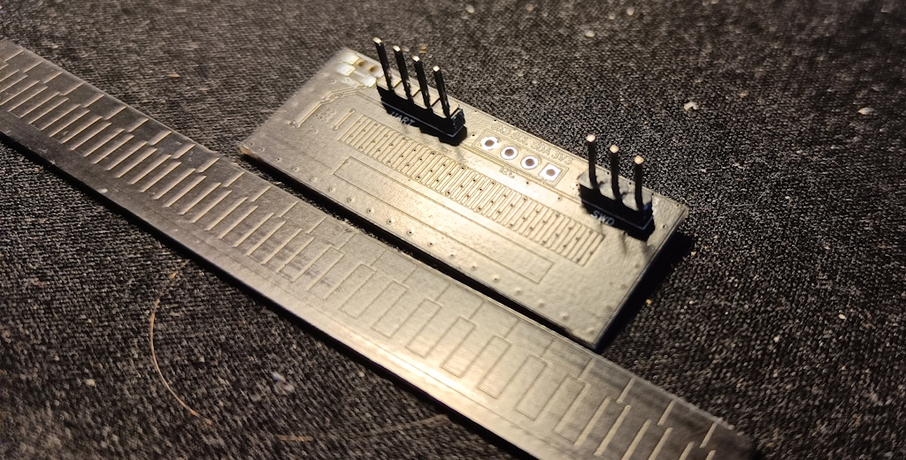
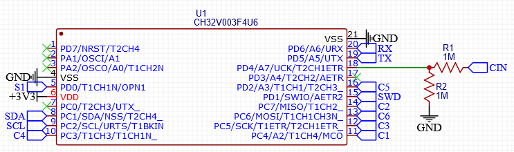

# CH32V003 Linear Encoder
This project uses a CH32V003, a 10-cent microcontroller, to create a capacitive linear encoder based on the mechanism that is commonly found in digital calipers. The software is based on [ch32v003fun](https://github.com/cnlohr/ch32v003fun), a open SDK for the CH32V003. 

## What does the hardware do?
A repeating pattern of 6 pads is layed out on the main circuit board. The microcontroller sends a sine wave to each of these pads, each one 60 degrees out of phase. Through the stator some of these signals are capacitively coupled to a large receiving pad, depending on the position of the stator. Then, the position can be determined from the phase shift of the sine wave that is received. The pattern is repeated every 3.81mm (150 mil), which means the shift in position should be significantly smaller than that for every period (1563Hz). 

Gerber files can be found in de `board` folder.

## What does the software do?
The signals are generated by feeding pre-computed sine wave values into the capture/compare registers through DMA. The DMA is triggered by the capture/compare of the corresponding timer channel, such that the values can be updated in time. The six channels were chosen such that there are three sets of signals that are 180 degrees out of phase, which are output on the CH1, CH2, CH3, and their complementary outputs.

Capturing the signal is done by triggering the ADC from the update event of this same timer. Then, the ADC in turn triggers DMA to write the captured value into an array. Once this array is full and a complete cycle has passed, an interrupt is triggered. In this interrupt the data captured by the ADC is processed. Note that the ADC is configured such that capturing takes longer than one PWM cycle, therefore ADC samples are captured at half the PWM frequency.

In the interrupt the signal is convoluted by two square waves, representing an approximation of a sine and cosine. Then, from a linear approximation the angle is calculated, which will determine the position of the stator.